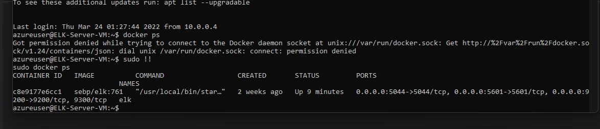

## Automated ELK Stack Deployment

The files in this repository were used to configure the network depicted below.

These files have been tested and used to generate a live ELK deployment on Azure. They can be used to either recreate the entire deployment pictured above. Alternatively, select portions of the *playbook* file may be used to install only certain pieces of it, such as Filebeat.

[Ansible](ansible/Ansible-playbook.yml) 
[ELK](ansible/ELK-playbook.yml)
[Filebeat](ansible/Filebeat-playbook.yml)
[Metricbeat](ansible/Metricbeat-playbook.yml)

This document contains the following details:
- Description of the Topologu
- Access Policies
- ELK Configuration
  - Beats in Use
  - Machines Being Monitored
- How to Use the Ansible Build

### Description of the Topology

The main purpose of this network is to expose a load-balanced and monitored instance of DVWA, the D*mn Vulnerable Web Application.

Load balancing ensures that the application will be highly *available*, in addition to restricting *traffic* to the network.
- *Load balancers ensure reliability by distributing network/taffic across multiple backend servers. This improves the user experience by protecting things like web security, availabilty and web traffic*
- *Jumbox serves as a gatway to gain entry into a seperate security zone/network. Often times, ssh is the main point of access. One can gain advantages with security, access control and network segmentation*

Integrating an ELK server allows users to easily monitor the vulnerable VMs for changes to the *data* and system *logs*.
- *Filebeat monitors the log files or locations that you specify, collects log events, and forwards them either to Elasticsearch or Logstash for indexing.*
- *Metricbeat takes the metrics and statistics that it collects and ships them to the output that you specify, such as Elasticsearch or Logstash.*

The configuration details of each machine may be found below.
_Note: Use the [Markdown Table Generator](http://www.tablesgenerator.com/markdown_tables) to add/remove values from the table_.

| Name     | Function | IP Address | Operating System |
|----------|----------|------------|------------------|
| Jump Box | Gateway  | 10.0.0.1   | Linux            |
| ELK VM   |Monitoring| 10.1.0.4   | Linux            |
| Web 1    | Server   | 10.0.0.5   | Linux            |
| Web 2    | Server   | 10.0.0.6   | Linux            |

### Access Policies

The machines on the internal network are not exposed to the public Internet. 

Only the *JumpBox-Provisioner* machine can accept connections from the Internet. Access to this machine is only allowed from the following IP addresses:
- 5061 Kibana

Machines within the network can only be accessed by *Workstation (local)* and *Jumpbox-Provisioner*.
- My local machine: 71.220.185.9 and Jumpbox-Provisioner: 10.0.0.4
A summary of the access policies in place can be found in the table below.

| Name     | Publicly Accessible | Allowed IP Addresses |
|----------|---------------------|----------------------|
| Jump Box | Yes  SSH Port 22    | My IP                |
|  Web 1   | No                  | 10.0.0.4             |
|  Web 2   | No                  | 10.0.0.4             |
|ELK Server| No  Kibana 5601     | 10.0.0.4             |

### Elk Configuration

Ansible was used to automate configuration of the ELK machine. No configuration was performed manually, which is advantageous because...
- *It allows for full automation of a specific server and reduces configuration errors*

The playbook implements the following tasks:
- The playbook can be viewed here [ELK-Playbook](Ansible/ELK-playbook.yml)

The following screenshot displays the result of running `docker ps` after successfully configuring the ELK instance.

### Target Machines & Beats
This ELK server is configured to monitor the following machines:
-Web1 : 10.0.0.5
Web2 : 10.0.0.6

We have installed the following Beats on these machines:
- *Filebeat and Metricbeat have been installed on the following Systems: Web1, Web2.*

These Beats allow us to collect the following information from each machine:
- Metricbeat coolects metrics (CPU, RAM...)
Filebeat logs data and 
### Using the Playbook
In order to use the playbook, you will need to have an Ansible control node already configured. Assuming you have such a control node provisioned: 

SSH into the control node and follow the steps below:
- Copy the *ELK-playbook.yml* file to **/etc/ansible/**.
- Update the *host* file to include the *ELK Server IP address (10.1.0.4)*
- Run the playbook, and navigate to the *ELK Server and run docker ps* to check that the installation worked as expected.

- _Which file is the playbook? *Elk-playbook.yml* Where do you copy it? */etc/ansible*
- _Which file do you update to make Ansible run the playbook on a specific machine? [Refer to the following file](Hosts/Webservers_and_ELK). How do I specify which machine to install the ELK server on versus which to install Filebeat on? *Give host a name and specify IP address under hosts*
- _  Which URL do you navigate to in order to check that the ELK server is running? *Public IP of ELK "104.42.115.150:5601"*

_As a **Bonus**, provide the specific commands the user will need to run to download the playbook, update the files, etc._